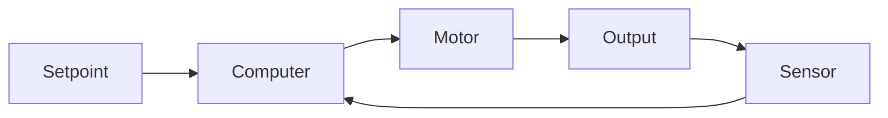

A Bang Bang controller is the simplest type of closed loop control. It is an on-off controller that switches the output fully on or fully off based on whether the process variable is above or below the setpoint. This type of controller is often used in systems where precise control is not required, and the system can tolerate some oscillation around the setpoint.

 
 **Can you guess what one of the most common Bang Bang controller applications is?**  - Click to reveal the answer. 
 Thermostats! 🌡️ 

