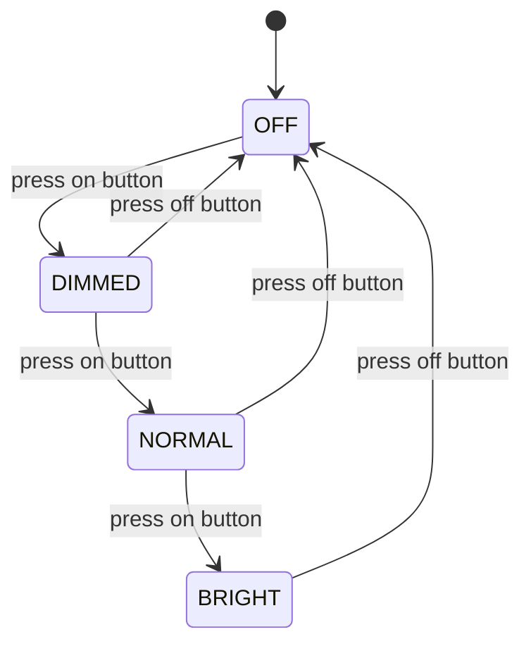
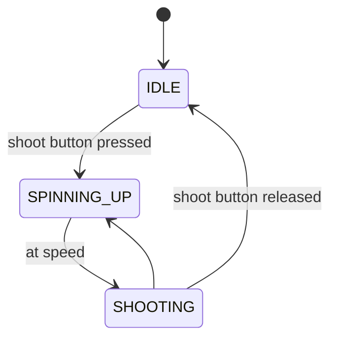

# State Machines

State machines are one of the most fundamental and powerful concepts in robotics programming. They help us organize complex robot behaviors by breaking them down into simple, manageable pieces called **states**.

## What is a State Machine?

Think of a state machine like a flowchart that describes how something behaves. It's a way to model systems that can be in different "modes" or "states" at any given time, and can transition between these states based on certain conditions.

### Real-World Examples

Before we dive into robotics, let's look at some everyday examples:

**Traffic Light**: A traffic light is a simple state machine with three states:
- **Red**: Cars must stop
- **Yellow**: Cars should prepare to stop
- **Green**: Cars can go

The traffic light transitions between these states based on time or sensors.

**Washing Machine**: Your washing machine has states like:
- **Fill**: Adding water
- **Wash**: Agitating clothes
- **Rinse**: Clean water cycle
- **Spin**: Remove water
- **Done**: Cycle complete

## Components of a State Machine

:::info States as Enums
The easiest way to represent states in code is by using an enumeration (enum). Enums allow us to define a set of named constants, making our code more readable and maintainable. For example, in Java, we can define the states of a traffic light like this:
```java
public enum TrafficLightState {
    RED,
    YELLOW,
    GREEN
}
```
See the documentation on [Variables and Data Types](../java/vars-dt/#enums) for more information on enums.
:::


## State Machine Diagram
State machines are often represented visually using state diagrams. These can be a great way to plan and communicate your robot's behavior. It is recommended to start with a simple diagram before implementing the state machine in code. Just to illustrate, here is a simple state diagram for a dimmer switch:




Lets look at something more related to robotics. Below is a simple example of a state diagram for a robot shooter/indexer:



There are some software tools that help you create state diagrams. One we have use in the past is [Mural](https://www.mural.co/). While you can always draw them by hand, it is ideal to have a digital copy that can be updated as our robot becomes more complex.
