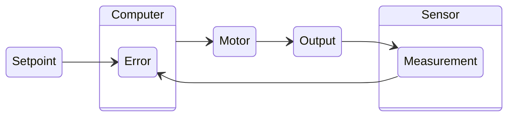

# Bang Bang Controllers
A Bang Bang controller is the simplest type of closed loop control. It is an on-off controller that switches the output fully on or fully off based on
whether the process variable is above or below the setpoint. This type of controller is often used in systems where precise control is not required, and
the system can tolerate some oscillation around the setpoint. While simple, Bang Bang controllers are a type of closed loop control as they rely on feedback from the system to determine the output state.

## How it Works
A Bang Bang controller operates by comparing the system measurement from a sensor to the system setpoint.
- If the measurement is below the setpoint, the controller turns the output fully on. 📈
- If the measurement is above the setpoint, the controller turns the output fully off. 📉

 
 **Can you guess what one of the most common Bang Bang
controller applications is?**  - Click to reveal the answer. 

Thermostats! 🌡️ 

:::warning Limitations
There is no proportional control or modulation of the output; it is simply on or off. The strength of the controller can be adjusted prior to execution, but it is constant during operation.
Due to this binary nature, Bang Bang controllers can lead to oscillations around the setpoint, which may not be suitable for systems requiring precise control.
If more precise control is needed, consider using a [PID controller](./pid.mdx) or other advanced control strategies.
:::