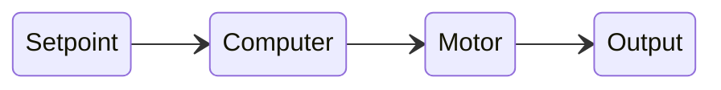
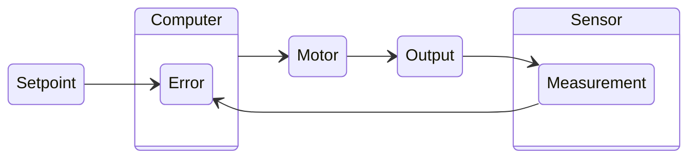

import 'katex/dist/katex.min.css';
import SystemControlQuiz from '@site/src/components/SystemControlQuiz';

# Control Theory
Control theory is a branch of engineering and mathematics that deals with the behavior of dynamical systems. Its main goal is to develop models and control strategies that ensure desired system behavior. Below are some key concepts and terms used in control theory.

- **Setpoint**: Desired value or state for system to reach. Is typically some real world measurable value.
    ```mermaid
    stateDiagram-v2
        direction LR
        classDef highlight font-weight:bold,stroke:red,stroke-width:2px;

        Setpoint:::highlight
    ```
- **Computer/Controller**: Primary control unit for the system. Performs all calculations for desired command based on the requested setpoint.
    ```mermaid
    stateDiagram-v2
        direction LR
        classDef highlight font-weight:bold,stroke:red,stroke-width:2px;

        Setpoint --> Computer:::highlight
    ```
- **Motor/Actuator**: Actuator for the system that is used to change the current state of the system.
    ```mermaid
    stateDiagram-v2
        direction LR
        classDef highlight font-weight:bold,stroke:red,stroke-width:2px;

        Setpoint --> Computer
        Computer --> Motor:::highlight
    ```
- **Output**: Effect the control has on the system. The reaction of the system from the applied command to the motor.
    ```mermaid
    stateDiagram-v2
        direction LR
        classDef highlight font-weight:bold,stroke:red,stroke-width:2px;

        Setpoint --> Computer
        Computer --> Motor
        Motor --> Output:::highlight
    ```
- **Sensor**: Device that measures the true output of the system. Allows you to checking what is happening and react instead of instructing the system blindly.
    ```mermaid
    stateDiagram-v2
        direction LR
        classDef highlight font-weight:bold,stroke:red,stroke-width:2px;

        Setpoint --> Computer
        Computer --> Motor
        Motor --> Output
        Output --> Sensor:::highlight
    ```
- **Measurement**: The measurement of the system is the actual reading of its condition at the given time.
    ```mermaid
    stateDiagram-v2
        direction LR
        classDef highlight font-weight:bold,stroke:red,stroke-width:2px;

        Setpoint --> Computer
        Computer --> Motor
        Motor --> Output
        Output --> Measurement:::highlight

        state Sensor {
            direction LR
            Measurement
        }
    ```
- **Error**: Difference between the setpoint and the sensor measurement. This is what the controller uses to determine how to adjust the output.
    ```mermaid
    stateDiagram-v2
        direction LR
        classDef highlight font-weight:bold,stroke:red,stroke-width:2px;

        Setpoint --> Error
        Computer --> Motor
        Motor --> Output
        Output --> Measurement
        Measurement --> Error:::highlight

        state Sensor {
            direction LR
            Measurement
        }

        state Computer {
            direction LR
            Error
        }
    ```

---

## Open Loop
Open loop control is a type of control system where the output is not fed back to the input for correction. In other words, the controller sends commands to the actuator without considering the actual output of the system. This type of control is simpler and easier to implement, but it can be less accurate and more susceptible to disturbances.

Below are some common types of open loop control:
- [Feed Forward Control](feed-fwd)

---

## Closed Loop
Closed loop control is a type of control system where the output is fed back to the input for correction. The controller continuously monitors the output and adjusts the input commands to minimize the error between the setpoint and the actual output. This type of control is more complex but can provide better accuracy and stability.

The feedback from the sensor allows the controller to make real-time adjustments to the motor commands based on the actual performance of the system. This is done by adjusting the control signal from the computer based on the calculated error.
$$
Error = Setpoint - Measurement
$$
Below are some common types of closed loop control:
- [Bang Bang Controller](bang-bang)
- [PID Controller](pid)

---

## When to Use Which?
When deciding between open loop and closed loop control, consider the following factors:

- **System Complexity**: Closed loop systems are more complex and require more components (sensors, feedback mechanisms) than open loop systems. If your system is simple and the environment is predictable, an open loop system may be sufficient.

- **Accuracy Requirements**: If your application requires high precision and accuracy, closed loop control is generally the better choice. Open loop systems can be affected by disturbances and changes in the environment, leading to less accurate control.

- **Response Time**: Closed loop systems can react to changes in the system more quickly because they continuously monitor the output and adjust the input accordingly. If your application requires fast response times, closed loop control may be necessary.

- **Cost and Complexity**: Open loop systems are typically less expensive and easier to implement than closed loop systems. If cost is a major concern and the application does not require high precision, an open loop system may be the better choice.

In summary, use open loop control for simple, low-cost applications where precision is not critical, and use closed loop control for more complex applications that require high accuracy and fast response times.

<SystemControlQuiz />

Obviously you need to do more than just indentify them. You will need to understand how they work and how to implement them. As a good place to start I would recommend reading the [Feed Forward](feed-fwd) page for open loop and the [Bang Bang](bang-bang) page for closed loop control.


