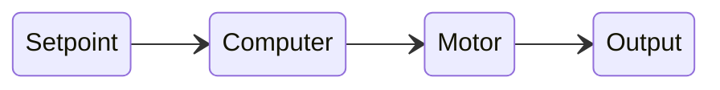

# Feed Forward Control
Feed Forward control is a type of open loop control that uses a mathematical model of the system to predict the required input to achieve a desired output. This is the primary open loop control concept, because there are not many other options without requiring feedback.

Unlike closed loop control, which relies on feedback from sensors to adjust the input, feed forward control anticipates the system's behavior and applies the necessary input directly. Sometimes that model can be a simple constant other times it can be a more complex equation. That model can only use the desired setpoint for its calculations since open loop control types dont have feedback. This page should serve as an introduction to feed forward control and how it can be used in FRC applications, but you can read more on WPILib's Feed Forward page [here](https://docs.wpilib.org/en/stable/docs/software/advanced-controls/introduction/introduction-to-feedforward.html).

For most of our applications using feed forward control, its just a simple % of the max output. For example if we want to run a motor at half speed we would just set the output to 50% of the max output. This is a very simple form of feed forward control. We don't care if the actual output matches the desired output exactly, as long as we are close enough for our purposes. Typically we won't even refer to this method as feed forward control, we will just call it open loop control or percent output control.

---

## Using a Mathematical Model
However there are some applications where a more sophisticated feed forward model is required. In these cases, we may need to take into account additional factors such as the system's dynamics or external disturbances. Luckily, there is an equation we can use to help us calculate the feed forward output.
$$
V = K_s \cdot sgn(\dot{d}) + K_v \cdot \dot{d} + K_a \cdot \ddot{d}
$$
Where $V$ is voltage to be applied to the motor, ${d}$ is position, $\dot{d}$ is the desired velocity, and $\ddot{d}$ is the desired acceleration.
Don't worry this equation is much simpler than it looks. The variables are as follows:
- $K_s$: The static gain, which determines the initial response of the system to a change in the desired output. This is typically the voltage needed to overcome friction and other static forces or in other words the minimum power needed to get the system moving. This is a constant value throught out motor operation since we assume friction is constant and presnet during acceleration and all velocities.
- $K_v$: The velocity gain, which accounts for the rate of change of the desired output. This is typically the voltage needed to maintain a certain velocity. This is a constant value throughout motor operation since we assume drag and other forces that resist motion are constant during all velocities. The relationship between speed and voltage is approximately linear for all FRC legal components.
- $K_a$: The acceleration gain, which considers the acceleration of the desired output. This is typically the voltage needed to achieve a certain acceleration. This is a constant value throughout motor operation since we assume inertia and other forces that resist changes in motion are constant during all velocities.

:::warning[Only use the required components]
For the simpliest application of a feed forward controller you can just use the velocity component. Many times the motorcontroller lets us supply a percentage of the max output, and no equation is needed. The equation should only be used if for precise control is required.
:::

Lets break down more of equation so its simpler to understand. The equation can be thought of as a sum of three components: the static component, the velocity component, and the acceleration component. Each component contributes to the overall output voltage based on the current state of the system.

### Static Component
Our static component is multiplied by the sign of the desired velocity. This means that if we want to move forward we will apply a positive voltage and if we want to move backwards we will apply a negative voltage. This is important because it ensures that we are always applying the correct direction of force to the system.
$$
K_s \cdot sgn(\dot{d})
$$

### Velocity Component
Our velocity component is simply the desired velocity multiplied by the velocity gain. This means that the faster we want to move, the more voltage we will apply. This is important because it allows us to control the speed of the system directly.
$$
K_v \cdot \dot{d}
$$

### Acceleration Component
Our acceleration component is the desired acceleration multiplied by the acceleration gain. This means that the more we want to accelerate, the more voltage we will apply. This is important because it allows us to control the acceleration of the system directly.
$$
K_a \cdot \ddot{d}
$$

---

## Variants of the Feed Forward Equation
There are many variants of this equation that can be used depending on the specific application. We use a few of them in FRC based on what system our robot has for that given year. These are most common to account for gravity.

### Elevator Feed Forward
Unlike some of the other systems, the elevator system has to account for the weight of the elevator itself. This means that we need to add a term to our feed forward equation that accounts for the gravitational force acting on the elevator. This is typically done by adding a term $K_g$ component to represent the voltage needed to hold the elevator in place against gravity.
$$
V = K_g + K_s \cdot sgn(\dot{d}) + K_v \cdot \dot{d} + K_a \cdot \ddot{d}
$$

### Arm Feed Forward
Arms have the same problem as elevators, but its a little more complex since the angle of the arm changes the amount of force needed to hold it in place. This means that we need to add a term to our feed forward equation that accounts for the gravitational force acting on the arm based on its angle. This is typically done by adding a term $K_g \cdot cos(\theta)$ component to represent the voltage needed to hold the arm in place against gravity.
$$
V = K_g \cdot cos(\theta) + K_s \cdot sgn(\dot{\theta}) + K_v \cdot \dot{\theta} + K_a \cdot \ddot{\theta}
$$
Where $\theta$ is the angle of the arm, $\dot{\theta}$ is the angular velocity, and $\ddot{\theta}$ is the angular acceleration.

---

## Determining the Constants
Finding the constants for your system can be done in a few different ways. The most common way is to use a tool like [SysId](https://docs.wpilib.org/en/stable/docs/software/advanced-controls/sysid/sysid-overview.html) to collect data from your system and then use that data to calculate the constants. Another way is to use trial and error to find the constants that work best for your system. This can be done by running the system at different speeds and accelerations and measuring the output voltage needed to achieve those speeds and accelerations. If the designers did their homework they could also have already calculated the constants based on the physical properties of the system. They may not be aware, but one of the tools they use called [ReCalc](https://www.reca.lc/) provides some theoretical gains which could act as a great starting point. Ultimately, the best way to find the constants is to use a combination of these methods to get the most accurate results.