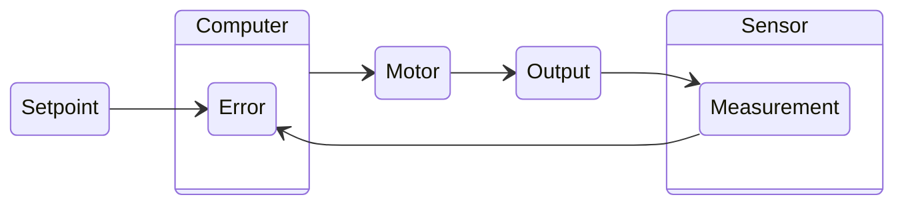

# PID Controllers
The Proportional-Integral-Derivative (PID) controller is a widely used control loop mechanism in engineering and robotics. It combines three control strategies to provide accurate and stable control of dynamic systems. It is the most commonly used control algorithm in FRC robotics due to its effectiveness in a variety of applications. A PID controller is closed loop meaning it uses feedback from the system to adjust its output.

---

## How it Works
A PID controller continuously calculates an error value as the difference between a desired setpoint and a measured process variable. It applies a correction based on three terms:
- **Proportional (P)**: This term produces an output that is proportional to the current error value. The larger the error, the larger the proportional response. This helps to reduce the overall error quickly.
- **Integral (I)**: This term accounts for the accumulation of past errors. It integrates the error over time, which helps to eliminate steady-state errors that may persist with just the proportional term.
- **Derivative (D)**: This term predicts future error based on its rate of change. It provides a damping effect, helping to reduce overshoot and improve system stability.

The Outputs from these three terms are summed to produce the final control output that is sent to the system's actuator (e.g., motor). The PID control equation is given by:
$$
V = K_p \cdot e(t) + K_i \cdot \int e(t)dt + K_d \cdot \frac{de(t)}{dt}
$$
Where:
- $e(t)$ is the current error (setpoint - measurement)
- $K_p$ is the proportional gain
- $K_i$ is the integral gain
- $K_d$ is the derivative gain

:::tip Never Seen Those Fancy Symbols Before?
It may look complicated but we can break it down into its three components using very simple math and ignore the calculus for our use case.
:::

### P Term
The proportional term is calculated by multiplying the current error by a proportional gain constant (Kp). This term provides an immediate response to the error, helping to reduce it quickly. The larger the error, the larger the proportional response. In our scary equation above this is represented by:
$$
P_{term} = K_p \cdot e(t)
$$
Let's break down what it's actually doing in simpler math terms. This term is simply taking the difference between where we want to be (setpoint) and where we are (measurement) and multiplying that by a constant value (Kp) to get our proportional output. Remember the difference between setpoint and measurement is our error.
$$
P_{term} = K_p \cdot Error
$$

### I Term
The integral term is calculated by summing the error over time and multiplying it by an integral gain constant (Ki). This term helps to eliminate steady-state errors that may persist with just the proportional term. It accumulates the error over time, providing a corrective action based on the history of the error. In our scary equation above this is represented by:
$$
I_{term} = K_i \cdot \int e(t)dt
$$
To simplify this term for our use case, we can think of it as adding up all the past errors (the difference between setpoint and measurement) over time and multiplying that sum by a constant value (Ki) to get our integral output.
$$
I_{term} = K_i \cdot \sum{Error}
$$

:::warning Caution with the I Term
While the integral term can be very effective in eliminating steady-state errors, it can also lead to instability if not tuned properly. Excessive integral action can cause the system to overshoot the setpoint and oscillate. Typically in a robotics application, we want to keep the integral term small or even zero unless absolutely necessary.
:::

### D Term
The derivative term is calculated by determining the rate of change of the error and multiplying it by a derivative gain constant (Kd). This term provides a damping effect, helping to reduce overshoot and improve system stability. It predicts future error based on its current rate of change. In our scary equation above this is represented by:
$$
D_{term} = K_d \cdot \frac{de(t)}{dt}
$$
To simplify this term for our use case, we can think of it as looking at how quickly the error is changing (the difference between setpoint and measurement) and multiplying that rate of change by a constant value (Kd) to get our derivative output.
$$
D_{term} = K_d \cdot \Delta{Error}
$$

### Final Output
The final output of the PID controller is the sum of the three terms:
$$
V = P_{term} + I_{term} + D_{term}
$$
This output is then sent to the system's actuator to adjust its behavior and bring the process variable closer to the desired setpoint.

---

## PID and Feed Forward
In many FRC applications, PID control is often used in conjunction with feed forward control to achieve optimal performance. The feed forward component provides a baseline output based on the desired setpoint, while the PID controller fine-tunes the output based on the actual system response. This combination allows for more precise control, especially in systems with varying loads or dynamics.

Often we will use the Feed Forward to linearize the system and get it "in the ballpark" of the desired setpoint, then use PID to clean up any remaining error and ensure we hit the target accurately.

The combined control output can be represented as:
$$
V = FeedForward + P_{term} + I_{term} + D_{term}
$$
Where the FeedForward is calculated using the methods described in the [Feed Forward Control](./feed-fwd.mdx) documentation.

---

## Tuning a PID Controller
Tuning a PID controller involves adjusting the gain constants (Kp, Ki, Kd) to achieve the desired system performance. We can mathematically determine these values through various methods, but in FRC we typically use a trial-and-error approach called "tuning". The goal of tuning is to find the optimal balance between responsiveness and stability.

:::danger Tuning Risks
Be very careful when tuning a PID controller on a live system. Aggressive tuning can lead to instability, oscillations, or even damage to the system. Always start with conservative values and gradually adjust them while monitoring the system's response. If you notice any erratic behavior, immediately stop and reassess your tuning approach.
:::

0. **Feed Forward**: If you have a feed forward component, set it up first to provide a good baseline for your system. See [Tuning a Feed Forward Controller](./feed-fwd.mdx#tuning-a-feed-forward-controller) for more information.
1. **Start with Kp**: Begin by setting Ki and Kd to zero. Increase Kp until the system responds quickly to changes in the setpoint but does not oscillate excessively. Start with very small values and gradually increase. Very small depends on the units of your system, but **0.0001** is a safe bet.
2. **Walk Up Kp**: You will likely not get a system response with such a small Kp. A good approach is to increase Kp by a factor of 10 until you see a response. Once you see a response, carefully increase Kp in smaller increments until you reach a point where the system starts to oscillate around the setpoint.
3. **Add Kd**: Once you have a good Kp value, start increasing Kd to help dampen any oscillations. Increase Kd until the system stabilizes and reaches the setpoint without overshooting too much. A good starting point for Kd is typically around 10% of your Kp value. As you add more Kd you may be able to increase Kp a bit more for a more responsive system.

:::note I Term is Very Rarely Needed
In most FRC applications, the integral term is not necessary and can often be left at zero. The P and D terms are usually sufficient to achieve good control performance. Only consider adding Ki if you notice a persistent steady-state error that cannot be corrected with P and D alone.
:::

