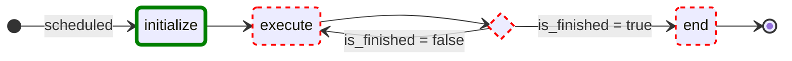

# Commands
:::warning Avoid Complex Commands!
Commands have special behavior that attempts to handle scheduling that can
make more complex robots unnecessarily complicated. The only use case for commands should be interfacing with buttons to
trigger a specific subsystem state. There should be little to no logic within the command. Most robot behavior should be handled within the subsystem state machines.
:::

## Command Structure
Commands are classes that extend the `Command` class. They have a few key methods that are used to define their
behavior:
- `initialize()`: Called once when the command is initially scheduled.
- `execute()`: Called repeatedly while the command is scheduled.
- `isFinished()`: Returns true when the command should end.
- `end(interrupted)`: Called once when the command ends, either because it finished or was interrupted.

These methods execute like a state machine, with `initialize()` running once, followed by repeated calls to `execute()`
until `isFinished()` returns true, at which point `end()` is called. Below is an example of a command as a state machine:


The execution of commands is managed by the Command Scheduler, which is responsible for scheduling, running, and ending commands.
It will call the appropriate methods on the command at the right times based on its state at a frequency of 50Hz (20ms intervals).

---

## Instant Command Types
There are several types of commands that provide different behaviors. All commands ultimately extend the base `Command` class. They all implement the same methods, but some have additional features or constraints.
The types listed below have auto implementations for some methods to simplify common use cases. These are all ways to implement simple commands without needing to create a full class or object for each one.
We can return instant commands to define simple behaviors of a subsystem without needing to create a full command class for each action.
This can prevent creating multiple instant commands each time we want to run a simple action on a subsystem and keeps the interaction consistent.
:::info
In the examples below, the state diagrams show the execution flow of each command type.
States that are highlighted in green indicate where user-defined behavior occurs, while states in red represent states with no user-defined behavior.

:::

### RunOnce Command
A command that runs a given function once and then finishes.
The definition requires only the function to run. It will run the function and then finish immediately after.

Here is an example that sets a solenoid to the forward position once:
```java
// Sets the hatch solenoid to the forward position once.
Commands.runOnce(() -> m_hatchSolenoid.set(kForward));
```

### Run Command
A command that runs a given function repeatedly until it is interrupted.
The definition requires only the function to run. It will run the function in `execute()` and never finish on its own.

Here is an example that runs the drive trains while the command is active:
```java
// A split-stick arcade command, with forward/backward controlled by the left
// hand, and turning controlled by the right.
Commands.run(() -> m_robotDrive.arcadeDrive(
    -driverController.getLeftY(),
    driverController.getRightX())
);
```


### StartEnd Command
A command that runs one function when it starts and another when it ends.
The definition requires the two functions. It will run the start function in `initialize()` and the end function in `end()`, never finishing on its own. It will not run anything in `execute()`.

Here is an example that starts a shooter when the command starts and stops it when the command ends:
```java
Commands.startEnd(
    // Start a flywheel spinning at 50% power
    () -> m_shooter.shooterSpeed(0.5),
    // Stop the flywheel at the end of the command
    () -> m_shooter.shooterSpeed(0.0)
);
```

### Wait Command
A command that does nothing for a specified duration. The definition requires only the duration. It will wait in `execute()` until the time has elapsed, but performs no actions during that time.

Here is an example that waits for 2 seconds:
```java
Commands.waitSeconds(2.0);
```

### Functional Command
A command that allows you to define custom behavior for each method using functions.
The definition requires functions for each of the command methods: `initialize()`, `execute()`, `isFinished()`, and `end()`.
This can be useful for more complex commands that still do not require a full class definition.


Here is an example of a command that dr ives the robot forward for a specified distance:
```java
new FunctionalCommand(
    // Reset encoders on command start
    m_robotDrive::resetEncoders,
    // Start driving forward at the start of the command
    () -> m_robotDrive.arcadeDrive(kAutoDriveSpeed, 0),
    // Stop driving at the end of the command
    interrupted -> m_robotDrive.arcadeDrive(0, 0),
    // End the command when the robot's driven distance exceeds the desired value
    () -> m_robotDrive.getAverageEncoderDistance() >= kAutoDriveDistanceInches
)
```

---

## Full Custom Commands
For more complex behaviors, you can create a full command by extending the `Command` class and implementing the necessary methods.
These require their own class file and can encapsulate more complex logic. They function similarly to the Functional Command and allow for complete control over the command's behavior.
Below is a template for creating a custom command that inherits from the `Command` class. We typically create a new file for each command in the `commands` package of our robot code.
```java
public class ExampleCommand extends Command {
  /** Creates a new ExampleCommand. */
  public ExampleCommand() {}

  // Called when the command is initially scheduled.
  @Override
  public void initialize() {}

  // Called every time the scheduler runs while the command is scheduled.
  @Override
  public void execute() {}

  // Called once the command ends or is interrupted.
  @Override
  public void end(boolean interrupted) {}

  // Returns true when the command should end.
  @Override
  public boolean isFinished() {
    return false;
  }
}
```

---

## Command Groups
Commands can be combined into groups to create more complex behaviors. There are several types of command groups available:
- [**SequentialCommandGroup**](https://github.wpilib.org/allwpilib/docs/release/java/edu/wpi/first/wpilibj2/command/SequentialCommandGroup.html): Runs commands in sequence, one after the other.
- [**ParallelCommandGroup**](https://github.wpilib.org/allwpilib/docs/release/java/edu/wpi/first/wpilibj2/command/ParallelCommandGroup.html): Runs commands in parallel, all at the same time.
- [**ParallelRaceGroup**](https://github.wpilib.org/allwpilib/docs/release/java/edu/wpi/first/wpilibj2/command/ParallelRaceGroup.html): Runs commands in parallel, but ends when the first command finishes.
- [**ParallelDeadlineGroup**](https://github.wpilib.org/allwpilib/docs/release/java/edu/wpi/first/wpilibj2/command/ParallelDeadlineGroup.html): Runs commands in parallel, but ends when a specified "deadline" command finishes.

These command groups allow you to create complex command sequences and behaviors by combining simpler commands.
We typically use these for more complex autonomous routines or multi-step actions. They are all define the same way by passing a list of commands to the constructor.
```java
new SequentialCommandGroup(
    new FirstCommand(),
    new SecondCommand(),
    new ThirdCommand()
);
```

---

## Command Decorators
Commands can be modified using decorators to change their behavior without altering the original command's code. These decorators can add functionality such as timeouts, delays, or conditional execution.
There are lots of available decorators in the `Command` class that can be seen in the [WPILib Command documentation](https://docs.wpilib.org/en/stable/docs/software/commandbased/convenience-features.html#command-decorators)
or the [API docs](https://github.wpilib.org/allwpilib/docs/release/java/edu/wpi/first/wpilibj2/command/Command.html). So of the more popular ones are listed below.
- `withTimeout(double seconds)`
    - Ends the command after the specified time has elapsed. (This is useful for safety to prevent a command from running indefinitely **especially in Autonmous**)
- `ignoreDisable(true/false)`
    - Allows the command to run even when the robot is disabled. (By default, commands do not run when the robot is disabled for safety reasons)
- `until(Supplier<Boolean> condition)`
    - Ends the command when the specified condition returns true. (This is useful for ending a command based on a specific event or state)
- `unless(Supplier<Boolean> condition)`
    - Prevent the command from starting if the specified condition returns true. (This is useful for preventing a command from running under certain conditions)
- `onlyIf(Supplier<Boolean> condition)`
    - Allows the command to run only if the specified condition returns true. (This is useful for ensuring a command only runs when certain criteria are met)
They can be chained together to create complex behaviors. Here is an example of using decorators to modify a command:
```java
Command myCommand = new ExampleCommand()
    .withTimeout(5.0) // Ends after 5 seconds
    .ignoreDisable(true) // Does run when disabled
    .until(() -> someConditionIsMet()); // Ends when a specific condition is met
```
We can also create command sequences with decarators
- `andThen(Command next)`
    - Schedules the specified command to run after the current command ends. (This is useful for creating command sequences without needing to create a full `SequentialCommandGroup`)
- `beforeStarting(Command previous)`
    - Schedules the specified command to run before the current command starts. (This is useful for setting up preconditions for a command without needing to create a full `SequentialCommandGroup`)
Here is an example of using these decorators to create a command sequence:
```java
Command myCommandSequence = new ExampleCommand()
    .andThen(new NextCommand()) // Runs after ExampleCommand ends
    .beforeStarting(new SetupCommand()); // Runs before ExampleCommand starts
```
:::tip
You can use these decorators on instant commands as well to create quick command sequences without needing to create full command classes.
:::

## Subsystem Commands
In order to interact with subsystems, we typically create commands that interface directly with the subsystem's state machine.
These commands are used to request specific states or actions from the subsystem. We try to keep these commands simple, often using instant commands to trigger state changes. To keep the code clean we typically create these commands within the subsystem's package.

```java
package frc.robot.subsystems.shooter;

public class ShooterCommands {

    /**
     * Command to set the shooter to the shooting state with the intent to shoot a ball.
     * @return Command to shoot a ball
    */
    public static Command shootBall(){
        return Commands.runOnce(() -> Shooter.getInstance().setState(ShooterState.SHOOTING));
    }

    // Additional subsystem commands can be added here
}
```

:::note static Keyword
In the example above, the `shootBall` method is declared as `static`, which means it can be called without creating an instance of the `ShooterCommands` class. This is useful for utility classes that provide a collection of related commands.

```java
// Usage for static method
ShooterCommands.shootBall();

// Usage for non-static method
ShooterCommands shooterCommands = new ShooterCommands();
shooterCommands.shootBall();
```
:::
