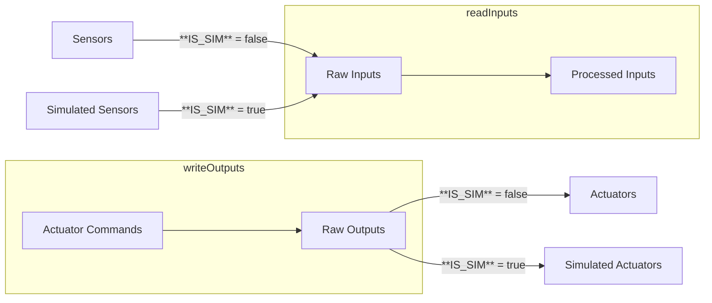
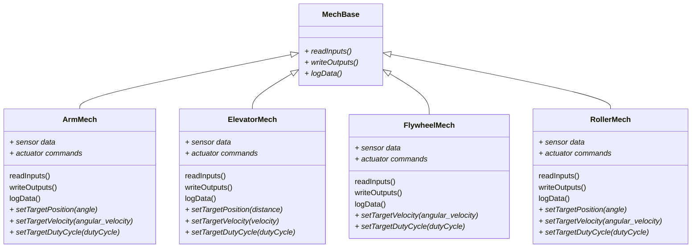

:::note MARS/WARS Custom Implementation
The mechanisms discussed on this page are part of our custom MWLib library developed specifically for MARS/WARS teams. They are not part of the official WPILib distribution but are designed to work seamlessly with it.
:::

# Mechanisms
Mechanisms are a a part of our MWLib library that help reduce implementation time for common robot mechanisms by providing pre-built classes and methods. They are designed to be modular and reusable, allowing us to quickly integrate complex mechanisms into our robot code with minimal effort.
This provides a high level overview for some of the mechanisms available in MWLib. For detailed documentation and usage examples, please refer to the [MWLib GitHub repository](https://github.com/FRC-Team-4143/MW-Lib).

The primary benefit to this architecture is to allow for easier adoption of robot simulation. The subsystems logic remains the same between simulation and real robot code, with only the mechanism implementations differing. This allows for a smoother transition between testing in simulation and deploying on the actual robot. The external API for the mechanisms remain consistent across operating modes and just the internal implementation changes based on whether the code is running in simulation or on the real robot hardware.

---

## Architecture
The mechanism in MWLib are built using a exclusive read and write architecture. This means that each mechanism has a dedicated method for reading sensor data and another for writing outputs to actuators. This separation helps to ensure that the mechanisms operate smoothly and efficiently, reducing the risk of conflicts between reading and writing operations. The also handle the necessary conversions between sensor units and physical units, making it easier to work with the mechanisms at a higher level. This high level concept is called an IO or Input/Output Container. Each *Mechanism* class is ultimately an IO container that handles the IO for a specific mechanism type.

The base functionality of the read and write methods can be visualized in the following diagram:



The `readInputs()` method is responsible for gathering data from the sensors (or simulated sensors) and processing it into a format that can be used by the mechanism. This may involve filtering, scaling, or converting raw sensor data into physical units. All of the processes inputs are saved into variables to be used throughout the class in calculation and logging. An example of this method is shown below:

```java
public void readInputs(double timestamp) {
    BaseStatusSignal.refreshAll(signals_);

    // always read the sensor data
    position_ = motor_.getPosition().getValue().in(Radians);
    velocity_ = motor_.getVelocity().getValue().in(RadiansPerSecond);
    applied_voltage_ = motor_.getMotorVoltage().getValueAsDouble();
    current_draw_ = motor_.getSupplyCurrent().getValue().in(Amps);
    motor_temp_c_ = motor_.getDeviceTemp().getValue().in(Celsius);
    bus_voltage_ = motor_.getSupplyVoltage().getValueAsDouble();

    // run the simulation update step here if we are simulating
    if (IS_SIM) {
        // Provide a battery voltage to the TalonFX sim so controller output is
        // meaningful
        motor_.getSimState().setSupplyVoltage(12.0);

        // Set input voltage from motor controller to simulation
        roller_sim_.setInput(motor_.getSimState().getMotorVoltage());

        // Update simulation by 20ms
        roller_sim_.update(0.020);

        // Convert meters to motor rotations
        double motorPosition = Radians.of(roller_sim_.getAngularPositionRad()).in(Rotations);
        double motorVelocity = RadiansPerSecond.of(roller_sim_.getAngularVelocityRadPerSec())
                .in(RotationsPerSecond);

        motor_.getSimState().setRawRotorPosition(motorPosition);
        motor_.getSimState().setRotorVelocity(motorVelocity);
    }
}
```
The `writeOutputs()` method takes the desired actuator commands and converts them into raw outputs that can be sent to the actuators (or simulated actuators). This may involve scaling, limiting, or converting physical units into raw actuator commands. The outputs written to the actuators should be stored in a variable to allow for logging. An example of this method is shown below:

```java
public void writeOutputs(double timestamp) {
    switch (control_mode_) {
        case POSITION:
            motor_.setControl(position_request_);
            break;
        case VELOCITY:
            motor_.setControl(velocity_request_);
            break;
        case DUTY_CYCLE:
            motor_.setControl(duty_cycle_request_);
            break;
        default:
            throw new IllegalStateException("Unexpected control mode: " + control_mode_);
    }
}
```
There is an additional method called `logData()` that is used to log important data from the mechanism for debugging and analysis purposes. This method can be customized to log specific data points that are relevant to the mechanism's operation. It can include data beyond what is used in the functional control of the mechanism such as temperature, voltage, or other diagnostic information. This data is both published live to NetworkTables and recorded in an onboard log file. An example of this method is shown below:

```java
public void logData() {
        // commands
        DogLog.log(getLoggingKey() + "control/mode", control_mode_.toString());
        DogLog.log(getLoggingKey() + "control/position/target", position_target_);
        DogLog.log(getLoggingKey() + "control/position/actual", position_);
        DogLog.log(getLoggingKey() + "control/velocity/target", velocity_target_);
        DogLog.log(getLoggingKey() + "control/velocity/actual", velocity_);
        DogLog.log(getLoggingKey() + "control/duty_cycle/target", duty_cycle_target_);

        DogLog.log(getLoggingKey() + "motor/applied_voltage", applied_voltage_);
        DogLog.log(getLoggingKey() + "motor/current_draw", current_draw_);
        DogLog.log(getLoggingKey() + "motor/temp_c", motor_temp_c_);
        DogLog.log(getLoggingKey() + "motor/bus_voltage", bus_voltage_);
    }
```
---

## Available Mechanisms
We have a couple of mechanisms available in MWLib. These mechanisms should be the base for most common robot designs. If you have a unique mechanism that is not covered, consider extending the existing classes or creating a new one based on the provided structure. This may require support from a mentor or team lead.
- **Arm**: The arm mechanism is designed to control a pivot joint that can rotate to various angles. It supports position control, velocity control, and duty cycle control.

- **Elevator**: The elevator mechanism is designed to control a linear translation system that can move up and down. It supports position control, velocity control, and duty cycle control.

- **Flywheel**: The flywheel mechanism is designed to control a high-speed rotating wheel, typically used for launching projectiles. It supports velocity control and duty cycle control.

- **Roller**: The roller mechanism is designed to control a rotating drum or wheel used for intaking or outtaking game pieces. It supports position control, velocity control, and duty cycle control.



There are additional "mechanism" that are more utility based and not full mechanisms by themselves. These include things like a Time of Flight Sensor or other single purpose devices. These are generally not full mechanisms but can be used as components within a larger mechanism or subsystem. A distance may be used in an intake, but does not belong to the pivot or the rollers directly.

---

## Interacting with Mechanisms
Interacting with mechanisms in MWLib is straightforward. Each mechanism class provides methods to set target positions, velocities, or duty cycles, depending on the type of mechanism. There are also methods to retrieve the current state of the mechanism, such as its position or velocity. These methods tend to follow a consistent naming convention across different mechanism classes, making it easier to switch between them:
- **Set Target Position**: `setTargetPosition(value)` - Sets the desired position for mechanisms that support position control.
    - `value` is typically in physical units such as radians for arms or meters for elevators.
- **Set Target Velocity**: `setTargetVelocity(value)` - Sets the desired velocity for mechanisms that support velocity control.
    - `value` is typically in physical units such as radians per second or meters per second.
- **Set Target Duty Cycle**: `setTargetDutyCycle(value)` - Sets the desired duty cycle for mechanisms that support duty cycle control.
- **Get Current Position**: `getCurrentPosition()` - Retrieves the current position of the mechanism.
- **Get Current Velocity**: `getCurrentVelocity()` - Retrieves the current velocity of the mechanism.

:::warning Getters and Setters Only
It is important to note that the mechanism classes are designed to be interacted with primarily through their public getters and setters. Direct manipulation of internal state variables is discouraged to maintain encapsulation and ensure proper operation of the mechanisms.
:::

:::tip Example Implementation
For an example of how to implement and use these mechanisms in a subsystem, refer to the [Subsystems Documentation](./subsystems/#using-the-mechanisms).
:::

---

## Simulation Overrides
When running in simulation mode, the mechanism classes automatically switch to using simulated sensors and actuators. This is handled internally by checking the `IS_SIM` flag within the read and write methods. As a user of the mechanism classes, you do not need to make any changes to your code to accommodate simulation; simply ensure that the `IS_SIM` flag is set appropriately for your environment.

However some behavior is not obtainable through the basic simulation implementation. Things like current draw, distance sensors, and other advanced readings may require additional overrides in during simulation. Refer to the specific mechanism documentation for details on any additional simulation requirements. There should be simulation specific methods that allow an sensor input override from a higher level simulation model.

:::danger Simulation Override in Simulation Only
While overriding the sensors through the methods described above will have simulation checks in place, it is important to only use these methods when running in simulation mode. Using them in real robot code could lead to unexpected behavior and potential logic bugs.
:::

