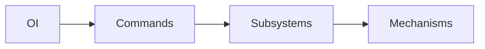

# Quick Reference Guide
This is a quick reference guide for programming our FRC robots using our standard libraries and practices. It is not a complete guide, but rather a summary of the most important concepts and code snippets.

## Data Flow and Architecture
Our robot architecture is based on a modular design that separates different components of the robot into distinct classes and packages. This allows for better organization, easier debugging, and more efficient collaboration among team members. The main components of our robot architecture include:
- **Subsystems**: These classes represent different subsystems of the robot, such as the drivetrain, elevator, and arm. Each subsystem is responsible for its own functionality and can be controlled independently.
- **Mechanisms**: These classes represent specific mechanisms or components of the robot, such as a flywheel or shooter. Mechanisms are typically used within subsystems to provide specific functionality.
- **Commands**: These classes represent specific actions or behaviors that the robot can perform. Commands are used to encapsulate the logic for executing a specific task, such as moving the robot or shooting a ball.
- **Operator Interface (OI)**: This class handles the interaction between the robot and the operator interface, such as game controllers or buttons. It reads input from the operator and sends commands to the appropriate subsystems or mechanisms.

The following diagram illustrates the relationships between these components:

OI is the highest level component that interacts with the operator. It receive the operator inputs and using commands sends state requests or call other methods on the subsystems. The subsystems then use mechanisms to perform the actual or simulated hardware control.

## Workflow
The best practice to follow when creating a new robot subsystem is:
1. Create the a Basic Subsystem class:
    - The steps to complete this can be found under [Creating a Subsystem](./subsystems.mdx#creating-a-subsystem).
    - Make sure to complete all steps including:
        - Creating the Subsystem Package
        - Creating the Subsystem Constants Class
        - Creating the Subsystem Class
        - Registering the Subsystem
2. Add Mechanisms as needed:
    - Refer to [Mechanisms](./mechanisms.mdx) for guidance on available mechanisms.
    - Steps to implement mechanisms can be found under [Adding Mechanisms](./subsystems.mdx#adding-mechanisms).
3. Define the Behavior for your State Machine
    - Implement the behavior for each state in the subsystem's state machine.
    - Refer to [Adding the State Machine](./subsystems.mdx#adding-the-state-machine) for guidance.
        - This includes defining the actions to be taken in each state and how to transition between states.
        - **Remember if you don't care about any transitions just leave the default implementation alone.**
4. Create Commands to interact with the Subsystem
    - Refer to [Commands](./commands.mdx) for guidance on creating commands.
    - Steps to create commands for your subsystem can be found under [Subsystem Commands](./commands.mdx#subsystem-commands).
5. Integrate with the Operator Interface (OI)
    - Map the commands to operator inputs in the OI class.
    - Refer to [Operator Interface (OI)](./oi.mdx) for guidance on binding the commands to a controller.

## Example Project Template
Below is an example project structure and code templates to help you get started with creating new subsystems. Please try to follow this structure and coding style to maintain consistency across the codebase. These templates provide a starting point, but you will need to customize them to fit the specific requirements of your subsystem.

### Package Template
```
src/main/java/frc/robot/
├── Robot.java
├── RobotContainer.java
├── OI.java
└── subsystems/
    ├── template/
    |       ├── TemplateSubsystem.java
    |       ├── TemplateConstants.java
    |       └── TemplateCommands.java
    └── example/
            ├── ExampleSubsystem.java
            ├── ExampleConstants.java
            └── ExampleCommands.java
```
### Subsystem Class Template
```java title="TemplateSubsystem.java"
public class TemplateSubsystem extends MwSubsystem<TemplateStates, TemplateConstants> {
    private static TemplateSubsystem instance_ = null;

    // Singleton Accessor
    public static TemplateSubsystem getInstance() {
        if (instance_ == null) {
            instance_ = new TemplateSubsystem();
        }
        return instance_;
    }

    public TemplateSubsystem() {
        // (Default State, Constants Class)
        super(TemplateStates.IDLE, new TemplateConstants());
    }

    @Override
    public List<SubsystemIoBase> getIos() {
        // Comma separated list of all the IO objects used by this subsystem
        return Arrays.asList(null);
    }

    @Override
    public void reset() {
        // Reset any user added variables here or systems to a known state
        system_state_ = TemplateStates.IDLE;
    }

    @Override
    public void updateLogic(double timestamp) {
        switch (system_state_) {
            // Handle each state behavior
            case IDLE:
                // Do nothing
                break;
            case CUSTOM_STATE:
                // Custom behavior here
                break;
        }

        // Log Data
        DogLog.log(getSubsystemKey() + "CustomString", data_value);
    }

    // Only override if you need custom state transitions!
    // @Override
    // public void handleStateTransition(TemplateStates wanted) {
    // }

    // Public Methods for Subsystem Behavior

    // Private Helper Methods
}
```

### Constants Class Template
```java title="TemplateConstants.java"
public class TemplateConstants extends MwConstants {

    // Subsystem States
    public enum TemplateStates {
        IDLE,
        CUSTOM_STATE,
        EXAMPLE_STATE
    }

    // All Subsystem specific constants go here
    public final int CONSTANT_EXAMPLE = 0;
    public final double ANOTHER_CONSTANT_EXAMPLE = 0.0;
    public final boolean ADDITIONAL_CONSTANT_EXAMPLE = false;

    public TemplateConstants() {
        // Some constants require dynamic initialization like through the JSON loader
    }
}
```

### Commands Class Template
```java title="TemplateCommands.java"
public class TemplateCommands {
    // Example Command to set the subsystem to a specific state
    public static Command setCustomStateCommand() {
        return Commands.runOnce(() -> {
            TemplateSubsystem.getInstance().setWantedState(ExampleStates.CUSTOM_STATE);
        });
    }
}
```
