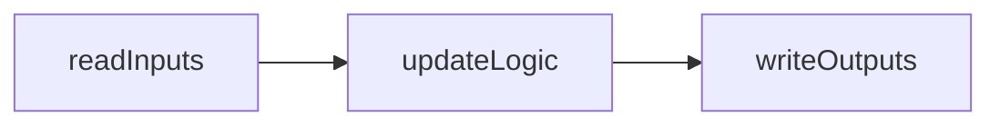

:::note MARS/WARS Custom Implementation
The subsystem execution concept discussed on this page are part of our custom MWLib library developed specifically for MARS/WARS teams. They are not part of the official WPILib distribution but are designed to work seamlessly with it.
:::

:::warning Mechanism Library
It is recommended to read through the Mechanism Library documentation before diving into Subsystems, as our subsystem implementation heavily utilizes mechanisms. You can find the Mechanism Library documentation [here](./mechanisms.mdx)
:::

:::warning State Machines
It is recommended to read through the State Machine documentation before diving into Subsystems, as our subsystem implementation heavily utilizes state machines. You can find the State Machine documentation [here](../controls/state-machines.mdx).
:::

# Subsystems
Subsystems are a fundamental concept in robot programming, representing distinct functional units of the robot. Each subsystem encapsulates specific hardware components and their associated behaviors, allowing for organized and modular code.

---

## Architecture
Subsystems follow a read, update, write architecture, where sensor data is read, processed, and then commands are sent to actuators. This architecture ensures that all subsystems operate in a synchronized manner, reducing the chances of conflicts and improving overall robot performance.


The `readInputs` and `writeOutputs` methods hidden and are called automatically by the subsystem framework. The `updateLogic` method is where the main logic of the subsystem is implemented. The subsystem framework ensures that these methods are called in the correct order during each robot cycle. However for our subsystems to we need to implement a couple of methods defined in the template `MWSubsystem` class.

**Update Logic:**
The `updateLogic()` method is where the main behavior of the subsystem is defined. This method is called periodically during each robot cycle, and it is responsible for processing sensor data, making decisions based on that data, and preparing commands to be sent to actuators. This method should implement the state machine that defines the subsystem's behavior.

**Reset:**
The `reset()` method is called to reset the subsystem to a known state. This is typically done at the start of a match or when the robot is disabled. In this method, you should reset any internal state variables, stop motors, and ensure that the subsystem is in a safe state.

**Get IOs:**
The `getIOs()` method is used to retrieve the input/output (IO) objects associated with the subsystem. These IO objects are typically instances of mechanism classes that represent the hardware components of the subsystem. This method allows the subsystem to access and control its hardware components.

---

## Creating a Subsystem
Creating a new subsystem can be a little daunting at first, but by following a structured approach, you can simplify the process. Our process is unique to MARS/WARS teams so be sure to follow these steps closely. ChatGPT or Goggle searches may not yield the correct results for our custom implementation. The following steps outline how to create a new subsystem from scratch:


### Create the Subsystem Package
Start by creating a new package within the `frc.robot.subsystems` directory. Name the package according to the subsystem you are creating, such as `drivetrain`, `shooter`, or `intake`. Remember a package is just a folder in this context.

### Create the Subsystem Constants Class
Within the newly created package, create a constants class to hold all the configuration values for the subsystem. This class should define constants for motor IDs, sensor ports, PID values, and any other configuration parameters needed for the subsystem. For example, if you are creating a shooter subsystem, you might create a class named `ShooterConstants`. Remember that any numbers that you may use in your code that are not arbitrary should be defined as constants in this class. The only exception to this rule is using 0 for stopping motors or etc.

It is important to define a new enum at the top of the class called `ShooterStates` in this example. This enum will define all the states that the shooter subsystem state machine can be in.

Below is an example of what the constants class might look like:
```java
public class ShooterConstants extends MwConstants {

    public enum ShooterStates {
        IDLE,
        SPIN_UP,
        SHOOTING
    }

    // Shooter Mech Configs
    public final int SHOOTER_ID = 10;
    public final boolean SHOOTER_INVERTED = false;
    public final double SHOOTER_GEAR_RATIO = 1.0;
    public final double SHOOTER_WHEEL_RADIUS_METERS = Units.inchesToMeters(3);
    public final double SHOOTER_WHEEL_MASS_KG = 2.3; // kg, approximate
    public final double SHOOTER_WHEEL_INERTIA = 0.5 * SHOOTER_WHEEL_MASS_KG * Math.pow(SHOOTER_WHEEL_RADIUS_METERS, 2.0); // kg m^2, approximate

    // Indexer Mech Config
    public final int INDEXER_ID = 11;
    public final boolean INDEXER_INVERTED = false;
    public final double INDEXER_GEAR_RATIO = 1.0;

    // Control Setpoints
    public final double SHOOT_DUTY_CYCLE = 0.5; // 50% power for shooting
    public final double INDEXER_DUTY_CYCLE = 0.3; // 30% power for indexing

    public ShooterConstants() {}
}
```
:::warning Class Inheritance
Ensure that your constants class extends `MwConstants` to inherit necessary functionality. The subsystem framework relies on this inheritance for proper operation.
:::

### Create the Subsystem Class
Next, create the subsystem class itself within the same package. Below is an example implementation of a `ShooterSubsystem` class that uses the `ShooterConstants` defined above.

```java
public class ShooterSubsystem extends MwSubsystem<ShooterStates, ShooterConstants> {
    private static ShooterSubsystem instance_ = null;

    public static ShooterSubsystem getInstance() {
        if (instance_ == null) {
            instance_ = new ShooterSubsystem();
        }
        return instance_;
    }

    public ShooterSubsystem() {
        super(ShooterStates.IDLE, new ShooterConstants());
    }

    // @Override
    // public void handleStateTransition(ShooterStates wanted) {
    // }

    @Override
    public void updateLogic(double timestamp) {
        switch (system_state_) {

        }
        // Log Data
        DogLog.log(getSubsystemKey() + "/State", system_state_.toString());
    }

    @Override
    public List<SubsystemIoBase> getIos() {
        return Arrays.asList(null);
    }

    @Override
    public void reset() {
        system_state_ = ShooterStates.IDLE;
    }
}
```
:::note @Override Annotations
The `@Override` annotations indicate that these methods are overriding methods defined in the superclass `MwSubsystem`. This is important for ensuring that the subsystem behaves correctly within the framework. If you forget to include these methods, the subsystem while likely fail to compile.
:::

This class extends `MwSubsystem`, specifying the state enum and constants class as type parameters. Make sure to state and constants type define in the class declaration:
```java
public class ShooterSubsystem extends MwSubsystem<ShooterStates, ShooterConstants>
```
We use a singleton pattern to ensure that only one instance of the subsystem exists. This is done using a private static variable and a public static `getInstance()` method. This means that anywhere in the code we need to access the `ShooterSubsystem`, we call `ShooterSubsystem.getInstance()` to get the single instance of the subsystem.
```java
private static ShooterSubsystem instance_ = null;

public static ShooterSubsystem getInstance() {
    if (instance_ == null) {
        instance_ = new ShooterSubsystem();
    }
    return instance_;
}
```
Anytime we need to access the subsystem we call `ShooterSubsystem.getInstance()`. This prevents us from accidentally creating multiple instances of the subsystem which would lead to unexpected behavior.

Make sure to call the superclass constructor in the subsystem constructor, passing in the initial state and a new instance of the constants class. This will make sure the subsystem is properly initialized using our custom framework. You can then add any additional initialization code needed for your subsystem after the superclass constructor call.
```java
public ShooterSubsystem() {
    super(ShooterStates.IDLE, new ShooterConstants());
}
```
Make sure to implement the `updateLogic()` method to define the behavior of the subsystem based on its current state. You can use a switch statement to handle different states and implement the corresponding logic for each state. See [Adding the State Machine](#adding-the-state-machine) below for more details.

The reset method should set the subsystem back to its initial state. This is important for ensuring that the subsystem starts in a known state when the robot is enabled.
```java
@Override
public void reset() {
    system_state_ = ShooterStates.IDLE;
}
```

### Register the Subsystem
Finally, ensure that the new subsystem is registered within the robot's main subsystem manager. This typically involves adding an instance of the subsystem to a list or map of subsystems that the robot manages. This step is crucial for the subsystem to be recognized and updated during the robot's operation. This is usually done in the `RobotContainer` class. Here is an example of how to register the `ShooterSubsystem`:

```java
public RobotContainer() {
    // !!!!!! ALL SUBSYSTEMS MUST BE REGISTERED HERE TO RUN !!!!!!!
    registerSubsystem(ShooterSubsystem.getInstance());
    // Add other subsystems here
    // !!!!! LEAVE THESE LINES AS THE LAST LINE IN THE CONSTRUCTOR !!!!!!
    reset();
}
```
:::warning Unregistered Subsystems Do Not Tick
Failing to register the subsystem will result in it not being updated or functioning correctly during robot operation.
:::

---

## Adding Mechanisms
Mechanisms are the building blocks of subsystems, representing individual hardware components such as motors, sensors, and actuators. To add mechanisms to your subsystem, follow these steps:

### Declare Mechanism IOs
In your subsystem class, declare the mechanism IO objects that represent the hardware components of your subsystem. These objects should be instances of the appropriate mechanism classes from the Mechanism Library. Remember you can have multiple mechanisms in a single subsystem.
```java
private RollerMech indexer_;
```
:::note These Objects Should be Private!
:::

### Initialize Mechanism IOs
In the subsystem constructor, initialize the mechanism IO objects using the configuration values defined in the constants class. This typically involves creating new instances of the mechanism classes and passing in the necessary parameters such as motor IDs, inversion flags, and gear ratios.
```java
public ShooterSubsystem() {
    super(ShooterStates.IDLE, new ShooterConstants());
    indexer_ = new RollerMech(/*FX Motor Config*/);

    indexer_.setLoggingPrefix(getSubsystemKey());
}
```
:::note Logging Prefix
Setting a logging prefix for each mechanism helps in organizing log data and makes it easier to identify which subsystem the data belongs to.
If you forget to set the logging prefix your log data for your mechanisms will show up under an Unknown subsystem.
:::

### Update the Subsystem IOs
Override the `getIOs()` method in your subsystem class to return a list of the mechanism IO objects. This allows the subsystem framework to access and manage the hardware components of the subsystem.
```java
@Override
public List<SubsystemIoBase> getIos() {
    return Arrays.asList(indexer_);
}
```
:::note Multiple Mechanisms
If your subsystem contains multiple mechanisms, include all of them in the list returned by the `getIOs()` method. This can just be done by adding them to the `Arrays.asList()` call.
```java
Arrays.asList(mechanism1_, mechanism2_, mechanism3_);
```
:::
:::warning IO Management
If this method is left empty none of your mechanism will be ticked. Ensure that you return the correct IO objects that correspond to the hardware components of your subsystem.
:::

### Using the Mechanisms
With the mechanisms added to your subsystem, you can now use them within the `updateLogic()` method to implement the desired behavior. This may involve reading sensor data, controlling motor outputs, and implementing state machine logic based on the subsystem's current state.
See [Mechanisms](./mechanisms.mdx) for more details on the interworkings of mechanims. Below is a simple example of using the indexer mechanism in the `updateLogic()` method:
```java
@Override
public void updateLogic(double timestamp) {
    switch (system_state_) {
        case IDLE:
            indexer_.setTargetDutyCycle(0.0);
            break;
        case INDEXING:
            indexer_.setTargetDutyCycle(constants_.INDEXER_DUTY_CYCLE);
            break;
    }
}
```

---

## Adding the State Machine
The state machine is a crucial part of the subsystem, defining its behavior based on different states. Our subsystem framework provides a structured way to implement state machines and it is expected that each subsystem will have one. Follow these steps to add a state machine to your subsystem:

### Define States
Ensure that you have defined an enum in your constants class that lists all the possible states for your subsystem. This enum will be used to represent the current state of the subsystem. This should be in the constants file associated with the subsystem. Here is an example of a state enum for a shooter subsystem:
```java
public enum ShooterStates {
    IDLE,
    SPIN_UP,
    SHOOTING
}
```

### Implement State Logic
In the `updateLogic()` method of your subsystem class, implement the logic for each state using a switch statement. This is where you define the behavior of the subsystem based on its current state.
```java
@Override
public void updateLogic(double timestamp) {
    switch (system_state_) {
        case IDLE:
            // Logic for IDLE state
            break;
        case SPIN_UP:
            // Logic for SPIN_UP state
            break;
        case SHOOTING:
            // Logic for SHOOTING state
            break;
    }
}
```

### Implement State Transitions
If you wish to handle state transitions explicitly, you can override the `handleStateTransition()` method. This method is called every loop and attempts to set the current state to the wanted state. If left unimplemented the subsystem will automatically transition to the wanted state.
```java
handleStateTransition(ShooterStates wanted) {
    system_state_ = wanted;
}
```
We can override this method to add conditions that must be met before allowing a transition to a new state. For example, we might want to prevent transitioning to the **SHOOTING** state unless the shooter is at the desired speed.
```java
@Override
public void handleStateTransition(ShooterStates wanted) {
    if(wanted == ShooterStates.SHOOTING && isAtShootingSpeed()) {
        system_state_ = wanted;
    } else {
        system_state_ = ShooterStates.SPIN_UP;
    }
}
```
### Updating the State
To change the state of the subsystem from other parts of the code, use the `setWantedState()` method. This method sets the desired state for the subsystem, which will be processed in the next update cycle.
```java
ShooterSubsystem.getInstance().setWantedState(ShooterStates.SHOOTING);
```
This will request the subsystem to transition to the **SHOOTING** state during the next update cycle, provided any conditions in `handleStateTransition()` are met. It helps ensure that state changes are managed in a controlled manner.

---

## Logging
Logging is an important aspect of subsystem development, as it allows you to monitor the behavior of the subsystem and diagnose issues. Our subsystem framework provides built-in logging capabilities that can be easily integrated into your subsystem. To log data from your subsystem, you can use the `DogLog` class to log relevant information such as the current state, sensor readings, and actuator outputs. Here is an example of logging the current state of the subsystem in the `updateLogic()` method:
```java
DogLog.log(getSubsystemKey() + "/State", system_state_.toString());
```
This will log the current state of the subsystem under a key that includes the subsystem's name, making it easy to identify in the logs. Make sure to log any other relevant data that will help you understand the subsystem's behavior during operation. This could include variables or internal subsystem states that are important for debugging or performance analysis. See more about logging and telemetry on the [Telemetry and Logging](./telemetry.mdx) page.

:::tip Mechanism Logging
Each mechanism also has its own logging capabilities. They will automatically log relevant data such as motor outputs, sensor readings, and internal state variables. Make sure to set the logging prefix for each mechanism to ensure that the log data is organized correctly. This is required in the mechanism constructor.
:::