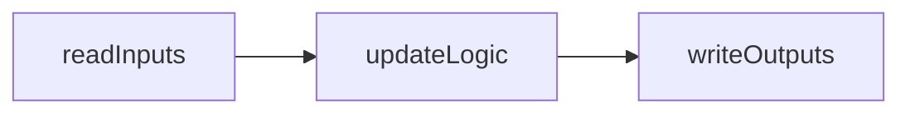

:::note MARS/WARS Custom Implementation
The subsystem execution concept discussed on this page are part of our custom MWLib library developed specifically for MARS/WARS teams. They are not part of the official WPILib distribution but are designed to work seamlessly with it.
:::

:::warning Mechanism Library
It is recommended to read through the Mechanism Library documentation before diving into Subsystems, as our subsystem implementation heavily utilizes mechanisms. You can find the Mechanism Library documentation [here](./mechanisms.mdx)
:::

:::warning State Machines
It is recommended to read through the State Machine documentation before diving into Subsystems, as our subsystem implementation heavily utilizes state machines. You can find the State Machine documentation [here](../controls/state-machines.mdx).
:::

# Subsystems
Subsystems are a fundamental concept in robot programming, representing distinct functional units of the robot. Each subsystem encapsulates specific hardware components and their associated behaviors, allowing for organized and modular code.

## Architecture
Subsystems follow a read, update, write architecture, where sensor data is read, processed, and then commands are sent to actuators. This architecture ensures that all subsystems operate in a synchronized manner, reducing the chances of conflicts and improving overall robot performance.

The `readInputs` and `writeOutputs` methods hidden and are called automatically by the subsystem framework. The `updateLogic` method is where the main logic of the subsystem is implemented.