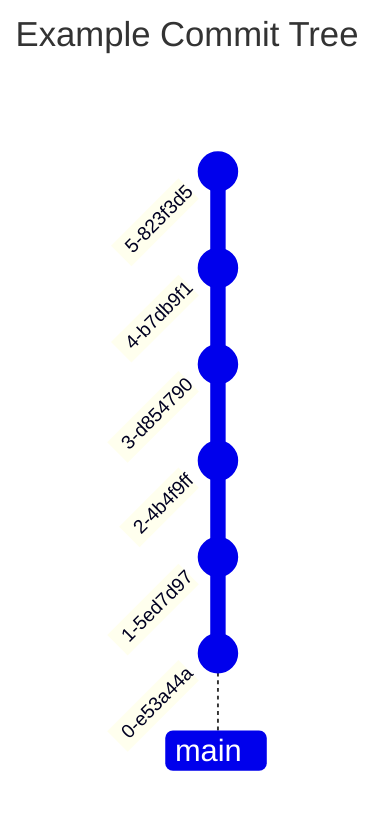
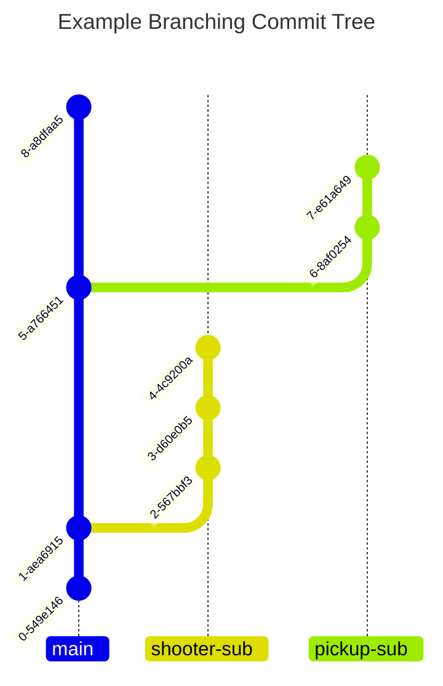
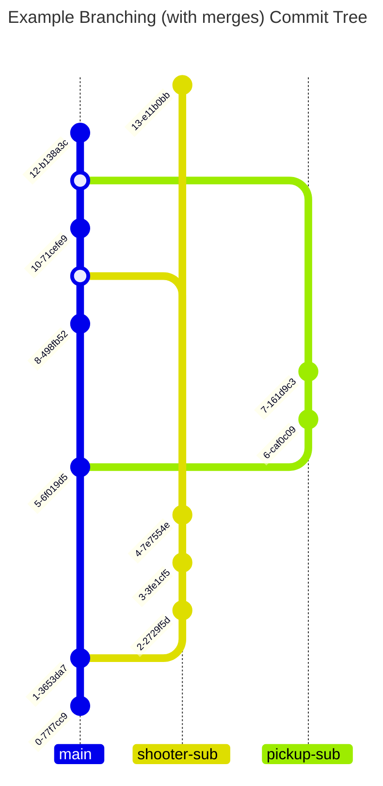

import gitStatus from '@site/static/img/software/tools/git/git-status.jpg';
import gitAdd from '@site/static/img/software/tools/git/git-add.jpg';

# Version Control with Git
Since we are a software team, we need to be able to track our code and changes made to it. This is where version control comes in. Version control is a system that allows us to track changes made to our code over time. It allows us to go back to previous versions of our code, see who made changes, and collaborate with other developers.

## Git
We use a tool called *git* for version control. This allows us to take "snapshots" of our code at a given time and save it for development documentation, reference, and backups. Git is a very powerful tool, but can be confusing and difficult to master. It also allows for simultaneous development across peers which is very helpful when multiple people are working on the same project.

Git can get very complicated and the best way to learn is by using it. You can read all the documentation you want, but until you actually use it, you won't really understand how it works. The best way to learn is to start using it and make mistakes. Don't be afraid to break things, that's how you learn! If you do break something, don't worry, we have backups and can help you fix it.

Make sure to read our documentation for a short brief, but I would recommend using an interactive tutorial like [Learn Git Branching](https://learngitbranching.js.org/). This will help you get a feel for how git works and how to use it effectively.

## Repos
A project that is tracked by git is called a *repository* or frequently shortened to *repo*. A repo is the file structure containing all the "code" used for the project. It also contains all git tracking information stored in a `.git` folder. It needs to know about all the [commits](#commits) and [branches](#branches) being made by all developers on the project to correctly update your local copy. Each programming project should live in its own repo. All of our robot projects are their own repo. We also have several other repos for generic projects like this website!


## Commits
The snapshots of your repo at a given moment of development is called a commit. Commits are a unique point in development that show the state of all tracked files in your repo. They are uniquely assigned a SHA, which is a long string of alpha-numeric characters. Something like `2c37172285088188fc6e7f100bc204fc4d6c446f` or `7a02abb2d621edc25a11c5869d9e6cb792c92580`. As you can see those are definitely unique, but not very helpful if we are trying to figure how what state the repo was in for that given commit. Luckily our buddy [Linus Torvalds](https://en.wikipedia.org/wiki/Linus_Torvalds) had that in mind and allowed us to attach a "commit message" to describe what the state of the repo was in for that given commit. For quick reference commits can also be abbreviated to the first 7 characters of the SHA, so `2c37172` or `7a02abb`. This is useful for quickly referencing commits in your code and documentation.

Good version control practice is to commit frequently, but not after every line of code. Think about the big picture. Did I just complete a small development task? Did I just fix a bug? Did I just create the structure for a new feature? If so you should probably commit. The idea is that your commits act as breadcrumbs and could show your development/thought process. 500+ line commits don't help anyone and can make it more difficult to figure out what you actually changed. A good rule of thumb is if you can't summarize your changes in less than 52 characters, your commit is too big.

Below is what a basic commit tree looks like:

Its not a pretty as our lovely custom made graphic above, but you can run the following command to see a similar tree for your repo.
```bash
git log --graph --oneline --decorate --all
```

All new changes made to your repo are considered unstaged until manually staged into your commit index. Staged changes will be added to your next commit. You can see the current staged status of your changes by running the command below.
```bash
git status
```


To create a commit first we need to stage changes from our working directory that we want included.  You can stage files you want included in your commit using the following command.
```bash
git add FILE_TO_STAGE_NAME
```


:::tip
There are shortcuts to stage multiple files at a time, but I will leave that to you to discover.
:::

Once you have staged everything you want included in your commit you can check the staged status again with `git status` to ensure everything looks correct. If everything is as expected you can create a commit with the following command.
```bash
git commit
```
This will open an editor to allow you to write you commit message. Remember what we talked about, short, but informative. After the commit is complete feel free to check the `git log` again to see your new commit.

## Branches
Branches are a way to create a separate line of development in your repo. This is useful for developing new features or fixing bugs without affecting the main line of development. The main branch is usually called `main` or `master`, but you can create as many branches as you want. Each branch has its own commits and can be merged back into the main branch when the development is complete. You can checkout a branch in your repo and it will update your working directory with the latest commit in that branch.

You can select what branch your working directory is currently on using the following command.
```bash
git checkout BRANCH_NAME
```
If you need to create a new branch, it will start at the current commit of the branch you are on. You can then make changes and commit them to the new branch without affecting the main branch. If you are starting development on a new feature or bug fix you can also create your own branch. The command below will create a branch with its parent commit/branch being what you currently have checked out in your working directory.
```bash
git checkout -b NEW_BRANCH_NAME
```

Branches allows us to work as a team without stepping on each other's toes. If you are working on a new feature, you can create a branch for that feature and work on it without affecting the main branch. Below is an example of a branch tree. As you can see there are two branches made from the main branch. Each branch has its own commits. The branch names are also short and to the point, but still give a good idea what was changed in the branch.


## Merge
Merges are used to combine the changes from one branch into another. This is useful when you have completed a feature or fixed a bug and want to bring those changes back into the main branch. When you merge a branch, git will try to automatically combine the changes from both branches. If there are no conflicts, the merge will be successful and the changes will be applied to the main branch. If there are conflicts, git will prompt you to resolve them before completing the merge.

Merges can be done in several ways, but the most common is to use a pull request. A pull request is a way to propose changes to a repo and have them reviewed by other developers before they are merged into the main branch. This is a good way to ensure that the changes are correct and do not break anything in the main branch. You can start a pull request from GitHub and have your peers review your changes before merging. You can merge branches directly in the command line, but it is recommended to use a pull request for larger changes or when working with a team. Read more about this [here](github.mdx).

Below shows a merge between several branches. The *shooter-sub* branch is merged back into the *main* branch. Then the *pickup-sub* branch is merged back into the *main* branch. This is a common workflow when working on a team and allows for easy collaboration and development.


You can merge any branch into your currently checked out branch using the following command. This will merge the content from `NEW_CONTENT_BRANCH_NAME` onto your current branch.
```bash
git merge NEW_CONTENT_BRANCH_NAME
```


## Push and Pull
While everything we have talked about has been in the local space, git allows us to establish a remote. This is a "cloud" instance of the repo that can be accessed by all members of the project, not just on a single computer. Our remote is setup through GitHub.

Once your branch is in a state that you want to push it to remote for either storage or for other developers to use you can ***PUSH*** ⬆️ your changes to your defined remote.
```bash
git push
```

If another developer has commit to the branch you are using from another computer you will need to make sure to ***PULL*** ⬇️ their changes into your working directory.
```bash
git pull
```

:::warning
Git can get very nasty if you try to do the following
    - Pushing to remote with your local repo missing commits on the remote repo
    - Pulling from remote with your local repo having additional commits not on the remote repo

It is very important that you pull before a work session to ensure your local repo is up to date with the remote repo. The same goes for pushing at the end of a work session. There are ways to fix it if this occurs, but will likely require help from a mentor, unless you are a git wizard 🧙.
:::